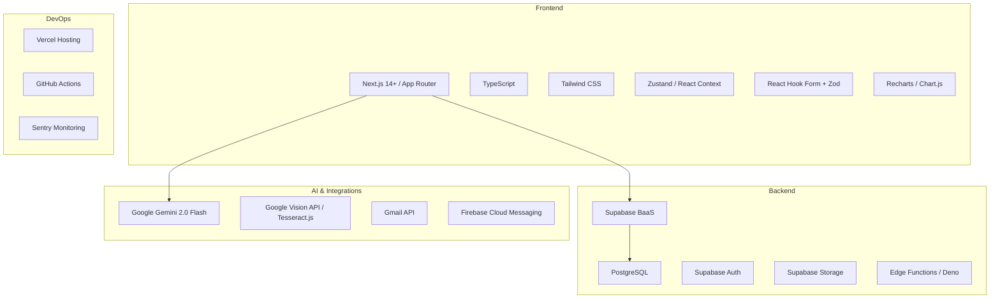
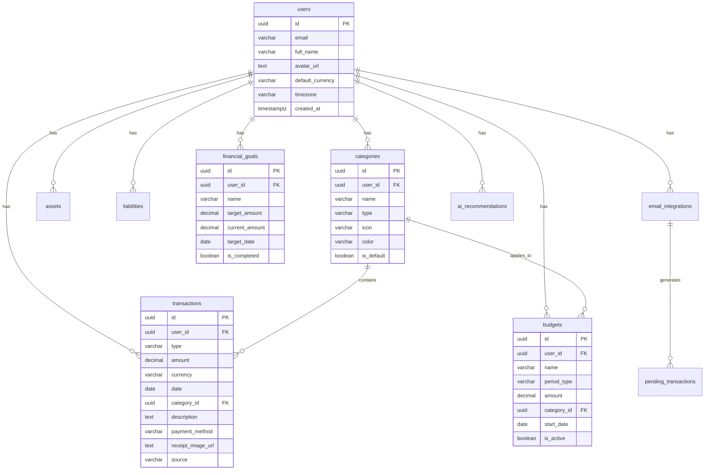

# Fintrack - Plan de Implementación

> **Documento generado a partir del PRD:** `PRD - Fintrack - Claude.tex`  
> **Fecha:** 22 de Enero, 2026  
> **Versión:** 1.0

---

## Resumen Ejecutivo

Este documento describe el plan de implementación para **Fintrack**, una Progressive Web Application (PWA) de control financiero personal. El proyecto se divide en **5 fases principales** que abarcan desde la configuración inicial hasta las características avanzadas de IA.

### Cronograma Estimado

| Fase | Nombre | Duración Estimada |
|------|--------|-------------------|
| 1 | Fundación y Configuración | 1-2 semanas |
| 2 | Core - Autenticación y Transacciones | 2-3 semanas |
| 3 | Gestión Financiera | 2-3 semanas |
| 4 | Insights e IA | 2-3 semanas |
| 5 | PWA, Pulido y Optimización | 1-2 semanas |

**Total estimado:** 8-13 semanas

---

## Stack Tecnológico



---

## Fase 1: Fundación y Configuración

### Objetivos
- Establecer la estructura base del proyecto
- Configurar el entorno de desarrollo
- Crear el sistema de diseño

### 1.1 Configuración del Proyecto

#### [NEW] Estructura de Carpetas
```
fintrack/
├── app/                    # Next.js App Router
│   ├── (auth)/            # Rutas de autenticación
│   ├── (main)/            # Rutas principales (protegidas)
│   ├── api/               # API Routes
│   └── layout.tsx
├── components/
│   ├── ui/                # Componentes base reutilizables
│   ├── features/          # Componentes por feature
│   └── layouts/           # Layouts
├── lib/
│   ├── supabase/          # Cliente y utilidades Supabase
│   ├── ai/                # Integraciones IA
│   └── utils/             # Utilidades generales
├── hooks/                 # Custom React Hooks
├── stores/                # Estado global (Zustand)
├── types/                 # TypeScript types
├── styles/                # CSS global
└── public/
    └── manifest.json      # PWA Manifest
```

#### Tareas
- [ ] Inicializar proyecto Next.js 14+ con TypeScript
- [ ] Configurar Tailwind CSS y sistema de diseño
- [ ] Configurar ESLint, Prettier, Husky
- [ ] Configurar next-pwa para Service Worker
- [ ] Crear manifest.json para PWA
- [ ] Configurar variables de entorno

### 1.2 Configuración de Backend (Supabase)

#### Tareas
- [ ] Crear proyecto en Supabase
- [ ] Configurar autenticación (Email + OAuth Google/Apple)
- [ ] Crear esquema de base de datos completo
- [ ] Implementar Row Level Security (RLS) en todas las tablas
- [ ] Configurar Supabase Storage para recibos
- [ ] Crear funciones Edge básicas

### 1.3 Sistema de Diseño

#### Componentes UI Base
- [ ] Button (variantes: primary, secondary, ghost, destructive)
- [ ] Input, Textarea, Select
- [ ] Card, Badge, Avatar
- [ ] Modal, Sheet (Bottom Sheet)
- [ ] Toast notifications
- [ ] Skeleton loaders
- [ ] FAB (Floating Action Button)
- [ ] Navigation (Bottom tabs, Sidebar)

---

## Fase 2: Core - Autenticación y Transacciones

### 2.1 Autenticación y Onboarding

#### Pantallas
- [ ] **Splash Screen** - Logo + loading
- [ ] **Welcome Screen** - Hero + CTAs
- [ ] **Onboarding Slides** (3 slides carousel)
- [ ] **Sign Up** - Email/password + OAuth
- [ ] **Sign In** - Login + recuperación
- [ ] **Password Recovery** - Flujo completo
- [ ] **Onboarding Setup** - 4 pasos post-registro

#### Funcionalidades
| ID | Funcionalidad | Descripción |
|----|--------------|-------------|
| F1 | Registro email/password | Validación, fortaleza password |
| F2 | OAuth Google/Apple | Integración Supabase Auth |
| F3 | Recuperación contraseña | Email de reset |
| F4 | Gestión perfil | Nombre, foto, preferencias |
| F5 | Config moneda/timezone | Selector con preview |

#### API Endpoints
```
POST /api/auth/signup
POST /api/auth/signin
POST /api/auth/signout
POST /api/auth/recover-password
PUT  /api/user/profile
PUT  /api/user/preferences
```

### 2.2 Gestión de Transacciones

#### Pantallas
- [ ] **Lista de Transacciones** - Filtros, agrupado por fecha
- [ ] **Agregar Transacción Manual** - Formulario completo
- [ ] **Detalle de Transacción** - Vista + edición
- [ ] **Escanear Recibo (OCR)** - Cámara + procesamiento
- [ ] **Entrada de Texto Natural** - NLP

#### Funcionalidades
| ID | Funcionalidad | Descripción |
|----|--------------|-------------|
| F6 | Registro por texto natural | Procesado por Gemini |
| F7 | Escaneo OCR de recibos | Vision API / Tesseract |
| F8 | Registro manual | Todos los campos |
| F9 | Edición/eliminación | Con confirmación |
| F10 | Adjuntar imagen | A transacción existente |

#### API Endpoints
```
POST   /api/transactions           # Crear
GET    /api/transactions           # Listar (filtros)
GET    /api/transactions/:id       # Detalle
PUT    /api/transactions/:id       # Actualizar
DELETE /api/transactions/:id       # Eliminar
POST   /api/transactions/ocr       # Procesar recibo
POST   /api/transactions/nlp       # Procesar texto
```

### 2.3 Gestión de Categorías

#### Pantallas
- [ ] **Lista de Categorías** - Predeterminadas + personalizadas
- [ ] **Crear/Editar Categoría** - Icono, color, tipo

#### Funcionalidades
| ID | Funcionalidad | Descripción |
|----|--------------|-------------|
| F15 | Categorías predeterminadas | Ingresos y egresos |
| F16 | Categorías personalizadas | CRUD completo |
| F17 | Iconos y colores | Selector visual |

---

## Fase 3: Gestión Financiera

### 3.1 Dashboard Principal

#### Pantallas
- [ ] **Dashboard Home** - Resumen mensual, gráficos, recientes

#### Funcionalidades
- Saludo personalizado + foto
- Card resumen del mes (ingresos, egresos, balance)
- Gráfico de flujo de caja (últimos 6 meses)
- Transacciones recientes (últimas 5)
- Widget patrimonio neto
- FAB para agregar rápido

### 3.2 Presupuestos

#### Pantallas
- [ ] **Vista Principal** - Tabs por período, cards con progress
- [ ] **Crear/Editar Presupuesto** - Formulario completo
- [ ] **Detalle de Presupuesto** - Progress, proyección, transacciones

#### Funcionalidades
| ID | Funcionalidad | Descripción |
|----|--------------|-------------|
| F22 | Presupuesto diario | Por categoría o total |
| F23 | Presupuesto semanal | Por categoría o total |
| F24 | Presupuesto mensual | Por categoría o total |
| F25 | Presupuesto anual | Por categoría o total |
| F26 | Seguimiento tiempo real | Gasto vs presupuesto |
| F27 | Alertas 80%/100% | Notificaciones |

#### API Endpoints
```
POST   /api/budgets              # Crear
GET    /api/budgets              # Listar activos
GET    /api/budgets/:id          # Detalle
PUT    /api/budgets/:id          # Actualizar
DELETE /api/budgets/:id          # Eliminar
GET    /api/budgets/:id/progress # Progreso actual
```

### 3.3 Activos y Pasivos

#### Pantallas
- [ ] **Vista de Patrimonio** - Neto, activos, pasivos
- [ ] **Crear/Editar Activo** - Formulario
- [ ] **Crear/Editar Pasivo** - Formulario

#### Funcionalidades
| ID | Funcionalidad | Descripción |
|----|--------------|-------------|
| F18 | Registro activos | Cuentas, inversiones, propiedades |
| F19 | Registro pasivos | Préstamos, tarjetas, deudas |
| F20 | Actualización valores | Manual |
| F21 | Patrimonio neto | Cálculo automático |

### 3.4 Metas Financieras

#### Pantallas
- [ ] **Lista de Metas** - Progress bars, proyección
- [ ] **Detalle de Meta** - Progress circular, timeline
- [ ] **Crear/Editar Meta** - Nombre, monto, fecha

#### Funcionalidades
| ID | Funcionalidad | Descripción |
|----|--------------|-------------|
| F28 | Crear meta | Nombre, monto objetivo, fecha |
| F29 | Asignar ahorros | Periódicos |
| F30 | Seguimiento visual | Progress bar |
| F31 | Notificaciones hitos | 25%, 50%, 75%, 100% |
| F32 | Proyección cumplimiento | Basada en ritmo actual |

---

## Fase 4: Insights e IA

### 4.1 Dashboard de Insights

#### Pantallas
- [ ] **Dashboard Insights** - Ratios, gráficos, comparativas
- [ ] **Recomendaciones IA** - Lista priorizada
- [ ] **Predicciones** - Proyecciones futuras
- [ ] **Exportar Reportes** - PDF

#### Funcionalidades
| ID | Funcionalidad | Descripción |
|----|--------------|-------------|
| F33 | Resumen mensual | Dashboard |
| F34 | Distribución gastos | Pie chart por categoría |
| F35 | Evolución temporal | Line chart |
| F36 | Flujo de caja | Mensual y acumulado |
| F37 | Tasa de ahorro | Ahorro/ingresos |
| F38 | Ratio endeudamiento | Pasivos/activos |
| F39 | Patrones de gasto | Detección IA |
| F40 | Recomendaciones IA | Personalizadas |
| F41 | Predicciones | Gastos futuros |
| F42 | Exportar PDF | Reportes |

#### API Endpoints
```
GET  /api/insights/dashboard        # Dashboard resumido
GET  /api/insights/cashflow         # Flujo por período
GET  /api/insights/ratios           # Ratios financieros
POST /api/insights/recommendations  # Generar con IA
GET  /api/insights/predictions      # Predicciones
POST /api/insights/export-pdf       # Exportar PDF
```

### 4.2 Sincronización con Email

#### Pantallas
- [ ] **Config Sincronización** - Status, frecuencia
- [ ] **Movimientos Pendientes** - Lista para aprobar/rechazar

#### Funcionalidades
| ID | Funcionalidad | Descripción |
|----|--------------|-------------|
| F11 | Conectar Gmail | OAuth |
| F12 | Escaneo automático | Programable |
| F13 | Detección transacciones | En emails bancarios |
| F14 | Cola de aprobación | Individual y masiva |

#### API Endpoints
```
POST /api/email/connect        # Conectar Gmail
GET  /api/email/status         # Estado integración
POST /api/email/scan           # Escaneo manual
GET  /api/email/pending        # Pendientes
POST /api/email/approve/:id    # Aprobar uno
POST /api/email/reject/:id     # Rechazar uno
POST /api/email/approve-bulk   # Aprobar múltiples
```

### 4.3 Procesamiento IA

#### API Endpoints
```
POST /api/ai/parse-receipt    # OCR + extracción
POST /api/ai/parse-text       # NLP texto → transacción
POST /api/ai/parse-email      # Extracción de email
POST /api/ai/categorize       # Sugerencia categoría
```

---

## Fase 5: PWA, Pulido y Optimización

### 5.1 Progressive Web App

#### Funcionalidades
| ID | Funcionalidad | Descripción |
|----|--------------|-------------|
| F43 | Instalación iOS | Desde Safari |
| F44 | Instalación Android | Desde Chrome |
| F45 | Funcionamiento offline | Con sincronización |
| F46 | Push notifications | Alertas y metas |
| F47 | Responsive | Mobile, tablet, desktop |
| F48 | Modo oscuro/claro | Configurable |
| F49 | Onboarding interactivo | Para nuevos usuarios |

### 5.2 Perfil y Configuración

#### Pantallas
- [ ] **Vista de Perfil** - Secciones con iconos
- [ ] **Configuración de Cuenta** - Editar datos
- [ ] **Preferencias** - Tema, notificaciones, idioma
- [ ] **Seguridad** - Biometría, exportar datos, eliminar cuenta

### 5.3 Calidad y Testing

#### Tareas
- [ ] Unit tests (Jest) - Lógica de negocio
- [ ] Integration tests - APIs críticas
- [ ] E2E tests (Playwright) - Flujos principales
- [ ] Configurar Sentry - Monitoreo errores
- [ ] Optimización de rendimiento
- [ ] Auditoría Lighthouse PWA

---

## Base de Datos

### Diagrama Entidad-Relación



---

## Consideraciones Importantes

### Manejo de Errores

| Escenario | Acción |
|-----------|--------|
| Fallo OCR | Permitir registro manual + opción reintentar |
| Fallo Gmail API | Notificar para re-autorizar + logs |
| Límites IA | Queue system + procesar al día siguiente |
| Sync offline | Marcar "pending_sync" + sync automático |
| Validación | Errores específicos por campo |

### Seguridad

- [ ] JWT token en todas las APIs
- [ ] Row Level Security (RLS) en Supabase
- [ ] Tokens OAuth encriptados
- [ ] Storage privado para recibos
- [ ] Rate limiting (100 req/min/usuario)
- [ ] Endpoints GDPR (exportar/eliminar datos)

### Escalabilidad

- Tier gratuito soporta 200-300 usuarios activos
- Cacheo de sugerencias de categorías
- Indexación de campos frecuentes
- Vistas materializadas para analytics

---

## Próximos Pasos

1. **Revisar y aprobar** este plan de implementación
2. **Priorizar** features para MVP vs futuras versiones
3. **Comenzar Fase 1** - Configuración del proyecto
4. **Establecer milestones** específicos con fechas

---

> [!NOTE]
> Este plan está basado en el PRD completo. Las estimaciones de tiempo pueden variar según la complejidad real encontrada durante el desarrollo.
